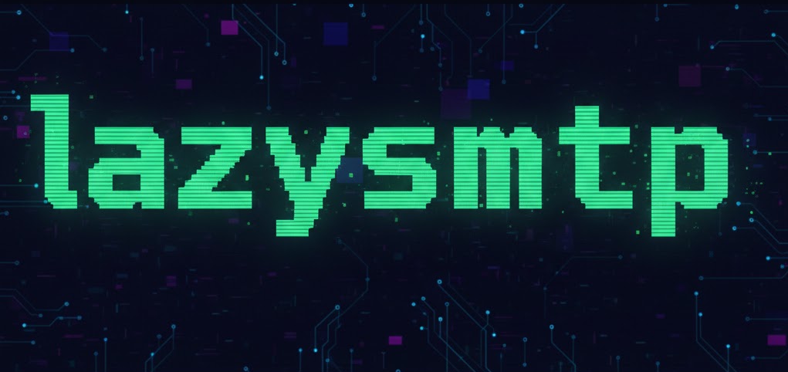

# lazySMTP

A terminal-based SMTP testing tool for developers. lazySMTP runs a local SMTP server with a TUI interface for inspecting received emails in real-time.



## Features

- **Built-in SMTP Server**: Automatically starts and stops with the application
- **TUI Interface**: Navigate and manage emails using keyboard shortcuts (hjkl)
- **Email Inspection**: View full email details including headers and body
- **Pure Go SQLite**: Zero-dependency, cross-platform database (no CGO required)
- **XDG Compliant**: Respects XDG Base Directory Specification for data storage
- **Email Management**: Delete individual emails or clear all
- **Developer-Friendly**: Perfect for testing email functionality without sending real emails

## Installation

### From AUR (Arch Linux)

```bash
yay -S lazysmtp-git
```

### From Source

Prerequisites:
- Go 1.20 or higher

```bash
git clone https://github.com/yourusername/lazysmtp.git
cd lazysmtp
make build
sudo make install
```

### Binary Download

Download the latest release from [GitHub Releases](https://github.com/yourusername/lazysmtp/releases)

## Usage

### Starting lazySMTP

```bash
lazysmtp
```

### Command-Line Options

```bash
lazysmtp -port 2525 -db custom.db
```

- `-port`: SMTP server port (default: 2525)
- `-db`: Path to SQLite database (default: XDG data directory)

### Keyboard Controls

- `j/k` - Navigate through emails (down/up)
- `d` - Delete selected email
- `SPACE` - Toggle SMTP server on/off
- `q` - Quit application

## Data Storage

lazySMTP follows the XDG Base Directory Specification:

- **Linux**: `~/.local/share/lazysmtp/lazysmtp.db`
- **macOS**: `~/Library/Application Support/lazysmtp/lazysmtp.db`
- **Windows**: `%APPDATA%\lazysmtp\lazysmtp.db`

## Technology Stack

- **Language**: Go
- **TUI Library**: gocui
- **SMTP Server**: go-smtp
- **Database**: SQLite (modernc.org/sqlite - pure Go, no CGO)
- **Operating Systems**: Linux, macOS, Windows

## Development

### Running Tests

```bash
make test
```

### Building

```bash
make build          # Build for current platform
make build-all      # Build for all platforms
```

### Project Structure

```
lazysmtp/
├── src/
│   ├── main.go           # Application entry point
│   ├── smtp.go           # SMTP server implementation
│   ├── database.go       # Database operations
│   ├── tui.go            # TUI layout and keybindings
│   ├── types.go          # Type definitions
│   ├── paths.go          # XDG path handling
│   ├── database_test.go  # Database tests
│   └── smtp_test.go      # SMTP utility tests
├── docs/
│   ├── laravel-integration.md
│   └── release-aur.md
├── Makefile
├── .goreleaser.yml
└── README.md
```

## License

MIT License - see LICENSE file for details

## Contributing

Contributions are welcome! Please feel free to submit a Pull Request.
